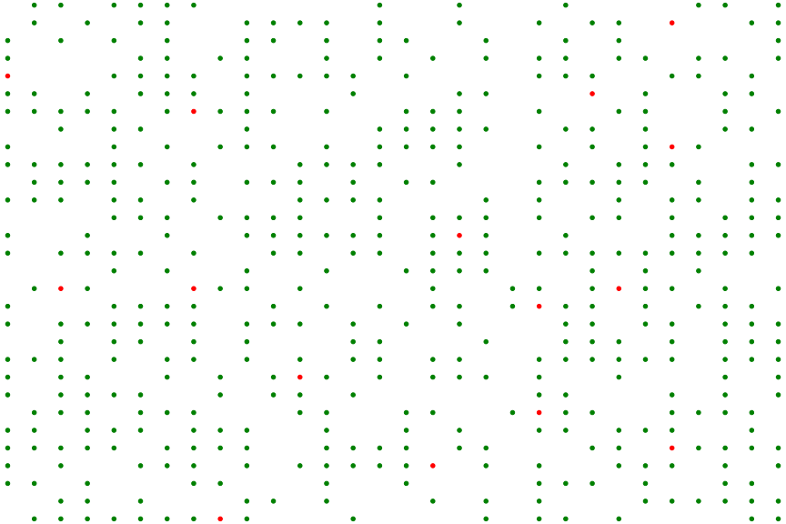

# COVID-19-Simulator
*Inspired by [BML Traffic Modeling](https://github.com/kdelrosso/traffic-flow-sim)*

## Objective
The purpose of the data analysis for the COVID-19 simulation data is to find the answer for the following questions:
- Is vaccination important?
- Is self-quanrantine for the infected important?

## How to develop the simulator and conduct data analysis
1. Two Python classes: Individual & Grid (N x N grid is used to describe an environment where individuals are moving around)
2. Visualize Data
  - Scatter plot with moving dots & time series data
3. Conclusion
4. Possible Future Works

## Understanding the classes: Individual and Grid
```
class Individual:
    def __init__(self, individual_id, vaccinated, x_A, y_A, x_B, y_B, color='green', infected=False):
        """
        @param individual_id: int, unique individual id
        @param color: str, 'red', 'green', or 'orange'. Default = 'green', representing not infected
                    : 'red' represents infected and 'orange' represents dead
        @param vaccinated: bool, either True or False
        @param immunized: bool, either True or False. Default = False
        @param recovered: bool, either True or False. Default = False
        @param p_infected: float, the probability of getting infected
        @param p_protection: float, the percentage of the protection against COVID-19 virus
        @param infected: bool, either True or False. Default = False
        @param x_A: int, x coordinate of the individual's location A
        @param y_A: int, y coordinate of the individual's location A
        @param x_B: int, x coordinate of the individual's location B
        @param y_B: int, y coordinate of the individual's location B
        """
```

```
class Grid:
    def __init__(self, r=100, c=100, n_vaccinated=None, n_not_vaccinated=None, p=None, n_individuals=None, n_infected=None, comply=True):
      """
      @param r: int, the grid size for row
      @param c: int, the grid size for column
      @param n_vaccinated: int, the number of vaccinated individuals
      @param n_not_vaccinated: int, the number of non-vaccinated individuals
      @param p: float, with in the interval of (0, 1), probability of vaccinated individuals
      @param n_individuals: int, number of individuals
      @param comply: bool, indicates if individuals comply with the quarantine policy when infected
      
      *Notes:
      ---
      input either
      n_vaccinated & n_not_vaccinated & n_infected OR
      p and n_individuals
      
      infected should be not_vaccinated for the initial setup
      """
```

### Additional Notes
- recovery time is set 14 seconds
- individuals move (+/-) 2 points
- additional parameter for infection to happen between individuals
```
individual_loc: locations of the individuals. If a not-infected individual shares the same location with the infected, 
it is considered as they are contacted. This might lead to a new infection
```

## How to generate the data
Example:
```
# num_vaccinated: 5, num_not_vaccinated: 480, num_infected: 15
grid = Grid(r=30, c=30, p=0.01, n_individuals=500, comply=True)
```
- This will provide the followings:
  - Summary data
  - Time series data
  - Scatter plot with moving dots (.gif file)
  - Time series graph


## Scatter plot with moving dots for different configurations
```
grid = Grid(r=30, c=30, p=0.01, n_individuals=500, comply=True)
```

